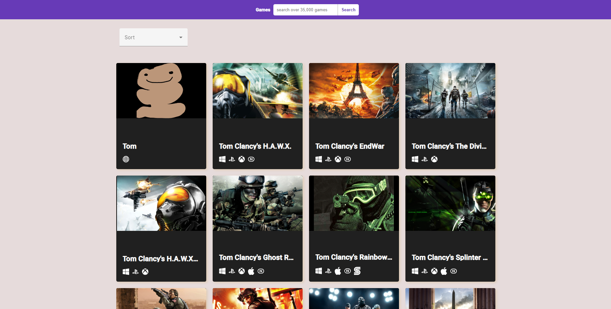
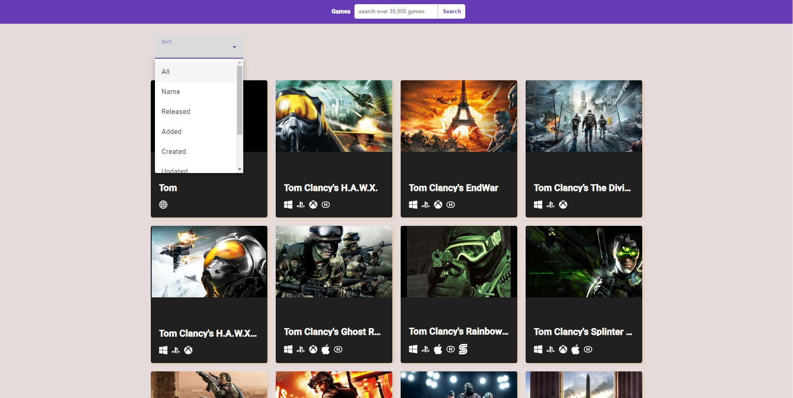
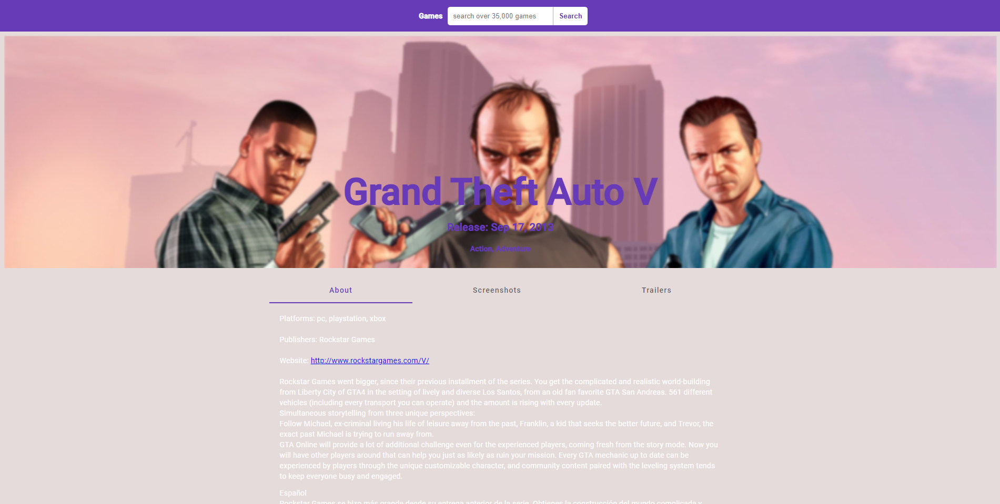
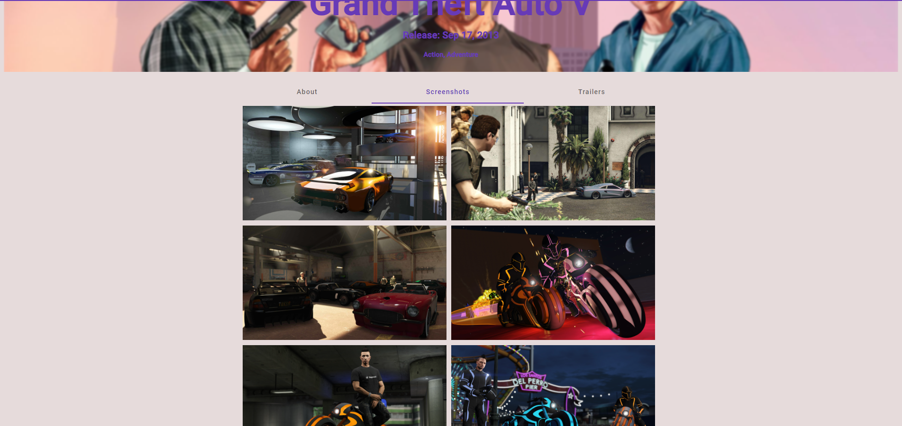

# GamesDb

This project was generated with Angular CLI version 15.0.5.

## API
`https://rawg.io/apidocs`

## Clone this repo to your devcie then run " npm install " to install dependencies

## Run `ng serve` for a dev server. Navigate to `http://localhost:4200/`. The application will automatically reload if you change any of the source files.

